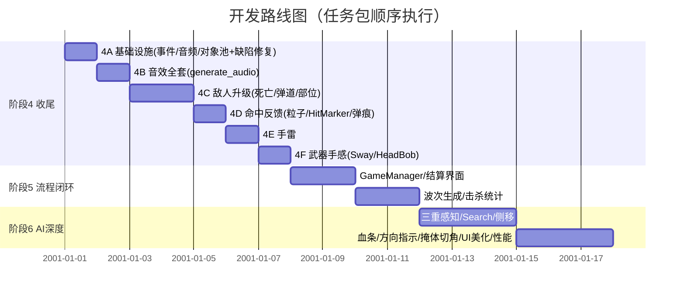

# TPS 战术射击游戏 · 开发计划文档

> **文档版本**：v1.0 | **创建日期**：2026-09-06 | **状态**：已确认，执行中
> **读者**：后续参与开发的 AI Agent（architect / coder / explore）及人类开发者
> **配套文档**：[DEVLOG.md](file:///k:/Unity/UnityProject/AI%20Test/Assets/DEVLOG.md)（开发日志与已知坑总库，**必读**）
> **项目规则**：[AGENTS.md](file:///k:/Unity/UnityProject/AI%20Test/AGENTS.md)（角色权限边界，铁律）

---

## 1. 项目背景

### 1.1 项目概况

| 项目 | 详情 |
|------|------|
| 引擎 | Unity 2022.3.62f2c1 LTS，URP 渲染管线 |
| 资源包 | PolygonBattleRoyale（低多边形军事包）+ P08_Federica 角色模型 + Basic Shooter Pack 动画 |
| 主场景 | `Assets/Scenes/SampleScene.unity`（800m DemoScene 岛屿关卡） |
| 菜单场景 | `Assets/Scenes/MainMenu.unity` |
| 输入 | 新 Input System（`Assets/Input/PlayerInput.inputactions`） |
| 相机 | Cinemachine 3.1.7（TPSCamera + ThirdPersonFollow 5m 肩越） |
| 动画 | Humanoid 混合（Mixamo/TPS），上半身 AvatarMask 分层 |
| 第三方 | DOTween（缓动） |
| 代码规模 | 18 个 C# 脚本（Player 7 / Combat 5 / Enemy 1 / UI 4 / Data 1） |

### 1.2 现状定位

项目已完成 4 个阶段的开发（详见 DEVLOG），**玩家操作层系统已全部打通**：移动/奔跑/跳跃、射击（Raycast+散布+后坐力）、弹匣+备弹双层弹药、3 武器切换（SO 数据驱动）、ADS 瞄准、蹲伏、左手 IK、敌人基础 AI（巡逻/追击/攻击）、拾取、HUD（血条/弹药/准星/红晕）、主菜单/暂停菜单/设置持久化。

### 1.3 差距分析结论（2026-08-31 对比参照项目 "TPS Shooter (Military style)"）

以完整 TPS 项目 `k:\Unity\UnityProject\TPS Shooter` 为基准逐系统对比，核心结论：

> **本项目缺的不是玩家操作层（该层已达到甚至超过参照项目），缺的是：**
> ① **战斗表现层反馈闭环**（零音效、无命中粒子、无敌人死亡动画）
> ② **敌人 AI 深度**（隔空扣血、无视线感知、无部位伤害）
> ③ **让 demo 变成"游戏"的流程管理**（无 GameManager、玩家死亡无结算、无波次/胜利目标）

差距矩阵摘要（P0=基本 TPS 必备缺失 / P1=流程闭环缺失 / P2=AI 深度差距 / P3=基础设施缺失）：

| 级别 | 缺失项 |
|------|--------|
| P0 | 音效系统、命中反馈（粒子/弹痕/爆头提示）、敌人真实弹道、敌人死亡动画、手雷、武器手感（Sway/HeadBob） |
| P1 | GameManager 流程状态机、死亡结算界面、敌人波次生成、击杀统计 |
| P2 | FOV+视线+噪音三重感知、Search 记忆状态、侧移射击、部位伤害 |
| P3 | 全局事件总线、AudioManager、对象池、7 处 `Find` 系列弱耦合 |

**本项目反超参照项目的部分（保持现状，勿倒退）**：Cinemachine 3 相机、新 Input System、URP 后处理调色、WeaponData SO 数据驱动、上半身动画分层、DOTween 菜单动效。

---

## 2. 核心目标与范围

### 2.1 游戏模式（已确认）

**波次生存（Wave Survival）**：玩家在 800m 岛屿关卡中抵御逐波来袭的敌人，波次全灭自动进入下一波，波次难度递增；玩家死亡进入结算界面（击杀数/存活波次/存活时间），可重玩或回主菜单。

### 2.2 已确认的技术决策（2026-09-06，不可擅自更改）

| 编号 | 决策项 | 结论 | 理由 |
|------|--------|------|------|
| D1 | 敌人弹道方案 | **Raycast 即时命中** + 曳光视觉（LineRenderer/FX_Bullet_Trail） | 简单、省性能、无防穿透问题；优于参照项目的实体子弹方案 |
| D2 | 事件总线规模 | **轻量静态事件**（静态类 + `event Action` 字段） | 符合现有代码风格；不引入 LightDev 式反射框架 |
| D3 | 游戏模式 | **波次生存** | 解决"杀完 8 个固定敌人即空场、无目标"问题 |
| D4 | 执行顺序 | 按 **4A → 4B → 4C → 4D → 4E → 4F → 阶段5 → 阶段6** 任务包推进 | 基础设施先行，避免返工 |

### 2.3 明确不做（Out of Scope）

- 可驾驶载具（DEVLOG 已知坑 15 已确认方案：静态摆放）
- 移动端支持、僵尸第二敌种
- 8 槽武器拾取/丢弃系统（保留现有 1/2/3 三槽固定武器）
- 多人联机、存档系统（仅保留 PlayerPrefs 设置项）

---

## 3. 技术架构

### 3.1 当前架构（现状）

```
┌─────────────────────────── 场景层 ───────────────────────────┐
│ MainMenu.unity                    SampleScene.unity          │
│  MainMenuController               Player / Enemies×8         │
│  (设置/Loading)                   TPSCamera / Canvas / 拾取物 │
└──────────────────────────────────────────────────────────────┘
┌─────────────────────────── 逻辑层（现有） ────────────────────┐
│ Player:  PlayerController / PlayerInputHandler / PlayerHealth │
│          PlayerADSController / PlayerCoverController          │
│          PlayerIKController / FootstepReceiver                │
│ Combat:  FirearmWeapon / WeaponManager / WeaponData(SO)       │
│          AmmoPickup / HealthPickup                             │
│ Enemy:   EnemyBase（if-else 距离驱动，非状态机）                │
│ UI:      UIManager / CrosshairController / PauseMenuController│
│ Data:    GameSettings（静态 PlayerPrefs 缓存）                 │
└──────────────────────────────────────────────────────────────┘
耦合方式：同物体 GetComponent 直引（主流）+ 局部事件（6个）
         + Find 系列全局查找（7处弱耦合，待治理）
```

### 3.2 目标架构（阶段 4~6 完成后）

```
┌─────────────────────────── 流程层（新增） ─────────────────────┐
│ GameManager（Playing/Paused/GameOver 状态机）                   │
│ EnemyWaveGenerator（波次生成）    GameOverPanel（结算界面）      │
└──────────────┬────────────────────────────────────────────────┘
               │ 订阅/广播
┌──────────────▼─────────────── 事件层（新增） ───────────────────┐
│ GameEvents（静态事件总线，见 §6.1）                              │
└──────┬────────────────┬───────────────────┬───────────────────┘
       │                │                   │
┌──────▼─────┐  ┌───────▼──────┐  ┌─────────▼─────────┐
│ 逻辑层(现有) │  │ AudioManager │  │ ObjectPool        │
│ +手雷/敌弹道 │  │ (事件驱动播音)│  │ (特效/弹痕/曳光池) │
│ +AI感知升级 │  └──────────────┘  └───────────────────┘
└────────────┘
```

**核心原则**：所有跨系统通信走 `GameEvents`；AudioManager 只听事件不主动查询；表现层对象（枪口焰/命中粒子/弹痕/曳光）一律走对象池。

### 3.3 新增基础设施组件

| 组件 | 文件路径 | 职责 | 依赖 |
|------|---------|------|------|
| GameEvents | `Assets/Scripts/Data/GameEvents.cs` | 静态事件总线，全游戏唯一跨系统消息通道 | 无 |
| AudioManager | `Assets/Scripts/Audio/AudioManager.cs` | 单例；AudioSource 池（3D 世界音 + 2D UI 音）；订阅事件播音；应用 GameSettings 音量 | GameEvents |
| ObjectPool | `Assets/Scripts/Data/ObjectPool.cs` | 通用对象池（键=预制体，栈式回收 + 预热）；供特效/弹痕/曳光/手雷使用 | 无 |
| GameManager | `Assets/Scripts/Data/GameManager.cs`（阶段5） | 游戏状态机；接管暂停流程职责；死亡→结算 | GameEvents |
| EnemyWaveGenerator | `Assets/Scripts/Enemy/EnemyWaveGenerator.cs`（阶段5） | 波次配置驱动刷怪 | GameEvents, ObjectPool(可选) |
| WaveConfig | `Assets/Scripts/Data/WaveConfig.cs`（阶段5） | 波次 SO 数据 | 无 |

---

## 4. 功能模块划分

### 4.1 现有模块（已完成，保持维护）

| 模块 | 脚本 | 状态 |
|------|------|------|
| 玩家移动 | PlayerController（188行：加速度平滑/动画速度归一化/动态 JumpSpeed） | ✅ 完整 |
| 射击核心 | FirearmWeapon（Raycast+散布+ADS收敛+RPM+后坐力） | ✅ 完整（表现层占位） |
| 武器管理 | WeaponManager（3槽切换/自动射击/弹药事件） | ⚠️ 有切枪刷弹缺陷（见 §11.2） |
| ADS 瞄准 | PlayerADSController（FOV 55→40/贴枪/减速） | ✅ 完整 |
| 蹲伏 | PlayerCoverController（高度/速度/动画） | ✅ 基础（掩体切角留阶段6） |
| 手部 IK | PlayerIKController（左手护木吸附） | ✅ 基础 |
| 敌人 AI | EnemyBase（巡逻/追击/隔空扣血） | ⚠️ 基础原型（阶段4C升级） |
| 拾取 | AmmoPickup / HealthPickup（Trigger 自动拾取） | ✅ 基础 |
| HUD | UIManager + CrosshairController | ✅ 完整 |
| 菜单 | MainMenuController + PauseMenuController | ✅ 完整（暂停面板缺 AutoShoot 开关） |
| 设置 | GameSettings（PlayerPrefs 5项） | ⚠️ SFXVolume 无消费方（4B 接通） |

### 4.2 新增模块（按任务包）

| 任务包 | 新增内容 | 涉及系统 |
|--------|---------|---------|
| **4A 基础设施** | GameEvents / AudioManager / ObjectPool + 4 项缺陷修复 | 全局 |
| **4B 音效全套** | 音频资产生成（generate_audio）+ 各系统事件接播音 | 音频 |
| **4C 敌人升级** | 死亡动画+尸体延时 / Raycast 弹道+曳光 / 部位伤害+爆头 | 敌人 |
| **4D 命中反馈** | 命中粒子（池化）/ HitMarker / 弹痕 | 表现 |
| **4E 手雷** | Grenade 投掷系统（G键/轨迹/引信/范围伤害） | 武器 |
| **4F 武器手感** | WeaponSway / HeadBob | 表现 |
| **阶段5 流程闭环** | GameManager / 波次生成 / 结算界面 / 击杀统计 | 流程 |
| **阶段6 AI 深度** | 三重感知 / Search 状态 / 侧移射击 / 敌人血条 / 受击方向指示 | 敌人 |

---

## 5. 关键实现设计（各任务包详设）

### 5.1 任务包 4A：基础设施先行

**产出**：
1. `GameEvents.cs` — 见 §6.1 接口定义
2. `AudioManager.cs` — 见 §6.2
3. `ObjectPool.cs` — 见 §6.3
4. 缺陷修复（见 §11.2 清单 F1~F4）

**验收**：编译 0 错误；现有玩法无回归；事件广播可被 AudioManager 收到（临时日志验证后移除）。

### 5.2 任务包 4B：音效全套

**音效资产制作方案**（用户已确认"先写着"）：
- 使用 Unity MCP 的 `generate_audio` 工具程序化生成，输出到 `Assets/Audio/` 目录
- 每类音效生成后需在 AudioManager 中建立 `AudioClip` 字段引用（Inspector 拖入）

| 音效 | 触发源（事件） | 数量 | 类型 |
|------|---------------|------|------|
| 枪声（步枪/SMG/手枪各一） | OnPlayerShot（带武器名参数） | 3 | 3D |
| 换弹（开始/结束） | OnReloadStart / OnReloadEnd | 2 | 3D |
| 脚步 | FootstepReceiver 动画事件（已有钩子，接 AudioManager） | 2~3（变体随机 pitch） | 3D |
| 玩家受击 | OnPlayerDamaged | 1 | 2D |
| 敌人受击/死亡 | OnEnemyDamaged / OnEnemyKilled | 2 | 3D |
| 敌人枪声 | OnEnemyShot | 1 | 3D（按距离衰减） |
| 拾取 | OnPickupTaken | 1 | 2D |
| 爆炸（手雷，4E 复用） | OnExplosion | 1 | 3D |
| UI 点击 | OnUIClick | 1 | 2D |

**GameSettings.SFXVolume 接通**：AudioManager.ApplyVolumes() 同时应用 MasterVolume 与 SFXVolume（UI 音走 Master， gameplay 音走 SFX × Master）。

### 5.3 任务包 4C：敌人升级

1. **死亡动画**：EnemyBase 死亡路径改为 `Animator.SetTrigger("Died")`（EnemyAnimator.controller 需新增 Die 状态，参照 PlayerAnimator 的 Die 层做法）→ 禁用 NavMeshAgent/Collider → 尸体保留 `corpseDuration`（建议 10s，Inspector 可调）→ Destroy。死亡时广播 `GameEvents.OnEnemyKilled(position)`。
2. **Raycast 弹道**（决策 D1）：攻击时从敌人枪口（FirePoint）向玩家方向 Raycast（射程内）；命中玩家→伤害；命中掩体→无效（天然解决隔墙扣血）。视觉：激活一束曳光（`FX_Bullet_Trail.fbx` 或 LineRenderer，ObjectPool 池化，存活 0.05~0.1s）。散布：加随机偏移使玩家可被"打歪"，命中率由 `accuracy` 字段控制。
3. **部位伤害**：敌人模型头部分离 Collider（或利用现有骨骼加 BoxCollider 标记 `isHead`）；FirearmWeapon 命中判定时 `GetComponent<EnemyPart>()` 区分 head/body，伤害倍率 headshotMultiplier=2。爆头击杀广播 `OnHeadshotKilled` 供 UI 提示。

### 5.4 任务包 4D：命中反馈

- **命中粒子**：命中点生成 impact 粒子（池化，0.5s 回收）
- **HitMarker**：准星中心 X 型标记，命中显示 0.15s（UIManager 扩展）
- **弹痕**：命中静态表面（tag/collider 判定）贴 decal（池化，上限 50 个循环覆盖）
- **爆头提示**：屏幕中部 "HEADSHOT" 文本，DOTween 淡入淡出（仿参照项目）

### 5.5 任务包 4E：手雷

- 按键：G（inputactions 新增 Grenade 动作）
- 流程：按下播放 `toss grenade.fbx` 掐雷 → 动画事件投出 → 抛物线（初速 = 相机forward×10 + up×7，参照项目验证过的参数）→ 落地弹跳（Rigidbody）→ 5s 引信 → 爆炸
- 轨迹预览：投掷准备时 LineRenderer 抛物线（可选做，若时间紧可砍）
- 爆炸：半径 5m 范围伤害（敌人/玩家均受）+ 爆炸粒子 + 震屏 + `OnExplosion` 事件
- 数量：初始 3 枚，UI 显示剩余（UIManager 扩展）
- 弹药池：手雷拾取物（可选，阶段5 一并做）

### 5.6 任务包 4F：武器手感

- **WeaponSway**：瞄准/移动时按输入旋转量做武器局部偏移（SmoothDamp 回位），参数钳制 maxAmount
- **HeadBob**：瞄准+移动时相机/武器正弦上下浮动（bobbingSpeed/Amount），静止复位
- 参照 `TPS Shooter/Scripts/Entities/Player/Weapon/WeaponSway.cs` 与 `HeadBob.cs` 的参数量级（可直接读这两个文件抄参数）

### 5.7 阶段 5：流程闭环

1. **GameManager**：单例；enum GameState { Playing, Paused, GameOver }；接管 PauseMenuController 的 timeScale 管理与脚本禁用逻辑（PauseMenuController 退化为纯 UI）；订阅 `OnPlayerDeath` → GameOver → 显示结算面板
2. **结算界面**：击杀数 / 存活波次 / 存活时间 / 最高波次 + 重玩（重载 SampleScene）/ 回主菜单
3. **EnemyWaveGenerator**：
   - `WaveConfig` SO：`Wave[] { EnemyPrefab, Count, SpawnInterval, SpawnPoints[] }` 数组，波次递增
   - 逻辑：监听 `OnEnemyKilled` + 定时轮询存活数 → 全灭 → waveIndex++ → 下一波（波间 5s 倒计时 UI 提示 "Wave N Incoming"）
   - 出生点：从出生点数组随机/轮询 + 出生保护（玩家 20m 外的出生点优先）
   - 场景中现有 8 个固定敌人改为首波配置（或保留为巡逻守卫 + 波次另算，**由 coder 实现时二选一并在 DEVLOG 记录**）
4. **击杀统计**：GameManager 计数 OnEnemyKilled，HUD 右上角显示

### 5.8 阶段 6：AI 深度（概要，实施前需 architect 再出详设）

- 感知升级：FOV 视锥（80°）+ Linecast 视线 + 距离环（Inner 15/Outer 20/Max 40，按当前 800m 关卡实际调参）
- 噪音值：玩家开枪=30 / 奔跑=7 / 走路=5 / 蹲走=3，敌人 Noise>距离 即听见
- Search 状态：丢失视线 → 奔向最后已知位置 → 超时回巡逻
- 侧移射击：攻击时左右横移（0.8s 换向）
- 世界空间敌人血条（受击显示，始终朝向相机）
- 受击方向指示器（径向扇形标记）
- 掩体切角（turn left / turning right 45° 动画已备）
- UI 美化 + URP 质量档/Draw Call 性能收官

---

## 6. 接口定义（ coder 实现时严格遵守 ）

### 6.1 GameEvents（静态事件总线）

```csharp
// Assets/Scripts/Data/GameEvents.cs
public static class GameEvents
{
    // ===== 玩家 =====
    public static event Action OnPlayerDamaged;          // 玩家受击
    public static event Action OnPlayerDeath;            // 玩家死亡（GameManager/结算订阅）
    public static event Action<Vector3> OnPlayerShot;    // 玩家开枪（枪口位置，音效/噪音）
    public static event Action OnReloadStart;            // 换弹开始
    public static event Action OnReloadEnd;              // 换弹结束

    // ===== 敌人 =====
    public static event Action<Vector3> OnEnemyKilled;   // 敌人死亡（波次/计分订阅）
    public static event Action OnHeadshotKilled;         // 爆头击杀（UI 提示）
    public static event Action<Vector3> OnEnemyDamaged;  // 敌人受击（音效）
    public static event Action<Vector3> OnEnemyShot;     // 敌人开枪（音效/受击方向）

    // ===== 战斗表现 =====
    public static event Action<Vector3, Vector3> OnBulletTrail; // 曳光(起点,终点)
    public static event Action<Vector3> OnExplosion;     // 爆炸（手雷）
    public static event Action OnHitConfirmed;           // 命中反馈（HitMarker）
    public static event Action OnPickupTaken;            // 拾取

    // ===== 流程（阶段5） =====
    public static event Action<int> OnWaveStarted;       // 波次开始（波号）
    public static event Action<int> OnWaveCleared;       // 波次清空
    public static event Action OnUIClick;                // UI 点击音

    // 每个事件配套静态 Invoke 方法（内部 null 检查）：
    // public static void RaisePlayerShot(Vector3 pos) => OnPlayerShot?.Invoke(pos);
}
```

**规范**：事件只增不改签名（破坏性变更需 architect 批准）；Invoke 方法命名 `Raise{事件名去掉On}`；订阅方必须在 `OnDestroy` 退订。

### 6.2 AudioManager

```csharp
// Assets/Scripts/Audio/AudioManager.cs —— 单例，DontDestroyOnLoad 不需要（每场景重创）
public class AudioManager : MonoBehaviour
{
    public static AudioManager Instance { get; private set; }
    // Inspector 拖入 AudioClip 字段 ×N（见 §5.2 音效表）
    // 2D UI 音源 ×1（走 MasterVolume）+ 3D 音源池 ×8（走 SFXVolume，SpatialBlend=1）
    public void PlayShot(Vector3 pos, string weaponName);   // 3D
    public void PlayReload(Vector3 pos, bool isEnd);
    public void PlayFootstep(Vector3 pos, float speed);     // 随机 pitch 0.9~1.1
    public void PlayUI(Vector3 pos /* 或重载无参 */);
    public void ApplyVolumes();                              // GameSettings → AudioListener + SFX 母线
}
```

### 6.3 ObjectPool

```csharp
// Assets/Scripts/Data/ObjectPool.cs —— 静态类或场景单例
public static class ObjectPool
{
    // 预热：public static void Prewarm(GameObject prefab, int count)
    // 取：public static GameObject Get(GameObject prefab, Vector3 pos, Quaternion rot)
    // 还：public static void Release(GameObject instance)  // 实例挂 PoolTicket 记录来源预制体
    // 约束：池化对象脚本不得在 OnDisable 中破坏状态；Release 后不得再引用
}
```

### 6.4 GameManager（阶段 5）

```csharp
public class GameManager : MonoBehaviour
{
    public static GameManager Instance { get; private set; }
    public GameState State { get; private set; }        // Playing / Paused / GameOver
    public int KillCount { get; private set; }          // 订阅 OnEnemyKilled 累加
    public int CurrentWave { get; private set; }
    public float SurvivalTime { get; private set; }     // Playing 状态累计

    public void Pause();     // timeScale=0 + 禁用 disableOnPause 脚本（接管 PauseMenuController 逻辑）
    public void Resume();
    public void TriggerGameOver();  // 订阅 OnPlayerDeath 调用；显示结算面板
    public void Restart();          // 重载 SampleScene
    public void ReturnToMenu();     // 回 MainMenu
}
```

---

## 7. 数据模型

### 7.1 现有 WeaponData（SO，勿破坏现有字段）

`Assets/Scripts/Combat/WeaponData.cs`：damage / fireRate(RPM) / magazineSize / reloadTime / range / spread / recoil / adsSpreadMultiplier / reserveAmmoMax / ammoPickupAmount / weaponPrefab / muzzleEffect。阶段 4C 起新增需求时**只增不改**。

### 7.2 新增 EnemyBase 可配置字段（4C）

```csharp
[Header("远程攻击(4C新增)")]
public float accuracy = 0.7f;          // 命中率（散布反向控制）
public GameObject bulletTrailPrefab;   // 曳光预制体（池化）
public float corpseDuration = 10f;     // 尸体保留时长
[Header("部位(4C新增)")]
public float headshotMultiplier = 2f;  // 爆头倍率（EnemyPart 读取）
```

### 7.3 新增 WaveConfig（SO，阶段 5）

```csharp
// Assets/Scripts/Data/WaveConfig.cs
[CreateAssetMenu(fileName = "WaveConfig", menuName = "TPS/WaveConfig")]
public class WaveConfig : ScriptableObject
{
    public Wave[] waves;
    [System.Serializable]
    public class Wave
    {
        public GameObject enemyPrefab;     // 敌人预制体（支持混合波时扩为数组）
        public int count;                  // 本波数量
        public float spawnInterval;        // 生成间隔
        public float startDelay = 5f;      // 波间准备时间
    }
    // 出生点在 EnemyWaveGenerator 场景组件上配置（Transform[]）
}
```

---

## 8. 开发规范

### 8.1 目录规范（AGENTS.md 约定 + 本次扩展）

```
Assets/Scripts/
  Player/    玩家行为（现有 7 个 + WeaponSway/HeadBob/GrenadeThrower）
  Combat/    武器战斗（现有 + Grenade.cs）
  Enemy/     敌人（EnemyBase + EnemyWaveGenerator + EnemyPart）
  UI/        界面（现有 + GameOverPanel/WaveBanner）
  Data/      数据与全局（GameEvents/ObjectPool/GameManager/WaveConfig/GameSettings）
  Audio/     新建：AudioManager
Assets/Audio/     新建：音频资产
Assets/Prefabs/   自制预制体（勿与资源包混放）
Assets/Materials/ 自定义材质
```

### 8.2 代码规范

- 私有字段 `_驼峰`，公开成员 `驼峰`，中文注释关键逻辑
- 事件/委托解耦优先，禁止新增 `Find` 系列调用（现有 7 处随任务包逐步治理为序列化引用）
- 新组件字段尽量 `[SerializeField]` + `[Header]` 分组，保持 Inspector 可调
- 敌人/战斗参数全部走 Inspector 或 SO，不硬编码

### 8.3 工作流铁律（AGENTS.md 摘要，违者返工）

1. **coder 改完任何 C# 脚本 → 必须 read_console 检查编译错误，0 错误才能继续**
2. 创建/修改资产后用 refresh_unity；新组件使用前确认 isCompiling=false
3. 场景必须有 Camera + Directional Light
4. 每阶段完成截图（manage_camera screenshot）给用户确认
5. architect 只出方案不改代码；coder 只按方案实现；explore 只审查
6. Unity API 不确定时 unity_reflect / unity_docs 验证
7. 每个任务包完成在 DEVLOG.md 追加记录（格式参照既有"阶段 X 记录"）

---

## 9. 进度计划



每个任务包的产出与验收标准见 §5.1~§5.8 对应小节。

---

## 10. 测试策略

### 10.1 每任务包必测（coder 自测 + explore 审查）

| 类别 | 项目 |
|------|------|
| 编译 | read_console：0 错误 0 警告 |
| 回归 | 现有按键全过一遍：WASD/Shift/Space/鼠标/左键射击/R换弹/右键ADS/C蹲/H治疗/1/2/3切枪/Tab暂停 |
| 功能 | 本任务包验收清单（§5 各小节） |
| 视觉 | manage_camera 截图给用户确认 |

### 10.2 专项测试要点

- **4A**：暂停时（timeScale=0）事件播音不冻结（AudioSource 用 unscaled 时间或不依赖 timeScale）；对象池 Release 后再 Get 状态干净
- **4B**：音量滑块即时生效（Master/SFX 两路独立验证）；3D 音随距离衰减
- **4C**：敌人隔墙**不再**扣血（掩体后站立验证）；爆头伤害 = 普通×2；尸体 10s 后消失且不影响 NavMesh
- **4D**：连发时 HitMarker 不闪烁卡死；弹痕上限 50 循环
- **4E**：手雷炸自己有效；5s 引信准确；轨迹不穿墙（Rigidbody 碰撞）
- **阶段5**：死亡必出结算；重玩后状态全清（击杀数/波次/手雷数）；波间倒计时正确；最后一波后进入无限循环波或胜利画面（**实施时与用户确认**）
- **已知坑回归**：坑 61（草地碰撞）修复后 NavMesh 有效——每次改场景静态碰撞体必须重烘焙 NavMesh（坑 65：反射 BuildNavMesh 不落盘，须 CreateAsset 持久化）

### 10.3 性能基线（阶段 6 收官）

- FPS 目标：编辑器 Game 视图 ≥ 60
- Draw Call：URP Renderer Debugger 记录基线并优化（静态合批/SRP Batcher 确认开启）
- 波次高峰（10+ 敌人）无 GC 尖峰：对象池全覆盖高频对象（特效/弹痕/曳光/手雷）

---

## 11. 关键注意事项

### 11.1 必读已知坑（DEVLOG 共 66 条，此处列高频踩雷项）

| 坑号 | 内容 |
|------|------|
| 18 | CharacterController 多次 Move 使 velocity 失真——动画取速度必须用自维护水平速度 |
| 28 | 编辑器内模拟按键不可靠——输入验证用"绑定存在 + 同模式佐证" |
| 50~52 | 代码创建 BlendTree/Transition 必须 timeScale=1 + AddObjectToAsset，否则磁盘引用丢失 |
| 55~57 | Humanoid 骨骼 reparent 被静默拒绝；预制体加子物体须"临时副本→改→SaveAsPrefabAsset" |
| 61 | **Synty 可行走地面 `_Convex` 凸包比可见网格高 0.3m**（已修 41 处，勿引入新的凸包地面） |
| 65 | NavMesh 反射烘焙不落盘，必须 AssetDatabase.CreateAsset 持久化 |

### 11.2 现存缺陷修复清单（4A 一并处理）

| 编号 | 缺陷 | 位置 | 修法 |
|------|------|------|------|
| F1 | 切枪刷弹：EquipWeapon 每次 Instantiate 后 Start 重置满弹 | WeaponManager/ FirearmWeapon | 武器数据缓存到 WeaponManager（切枪前保存/切回恢复弹匣与备弹） |
| F2 | 暂停菜单设置缺 AutoShoot 开关（与主菜单不对称） | PauseMenuController | 补 Toggle，读写 GameSettings.AutoShoot |
| F3 | 敌人 Debug.Log 每 0.5s/敌 刷屏 | EnemyBase | 包 `#if UNITY_EDITOR` 或删除 |
| F4 | `GameObject.Find("TPSCamera")` 字符串耦合（坑 6） | PlayerADSController | 改 `[SerializeField]` 引用，场景中拖入 |

### 11.3 协作约定

- 本文档为**唯一规划基准**；与 DEVLOG 冲突时以本文档为准并回改 DEVLOG
- 每任务包完成：coder 在 DEVLOG 追加记录 → explore 审查 → 用户截图确认 → 下一包
- 任何超出本文档范围的设计变更（新系统/改决策 D1~D4）：**必须先由 architect 出补充方案并经用户确认**，禁止 coder 自行扩展

---

## 12. 术语表

| 术语 | 含义 |
|------|------|
| ADS | Aim Down Sight，右键瞄准（FOV 收窄+贴枪+散布收敛） |
| 波次生存 | Wave Survival，本项目的核心游戏模式（决策 D3） |
| 曳光 | Bullet Trail，弹道视觉表现（LineRenderer/FX_Bullet_Trail，非真实弹体） |
| 部位伤害 | Head/Body 差异倍率，爆头 ×2 |
| 任务包 | 4A~4F/阶段5/阶段6 的最小交付单元，含产出+验收标准 |
| 轻量静态事件 | 静态类 event 字段总线（决策 D2），区别于参照项目的 LightDev 反射框架 |
| Synty | PolygonBattleRoyale 资源包厂商名 |
